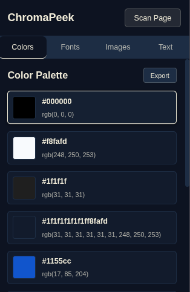
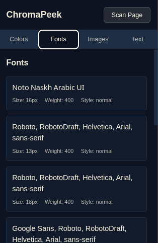
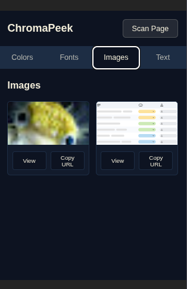
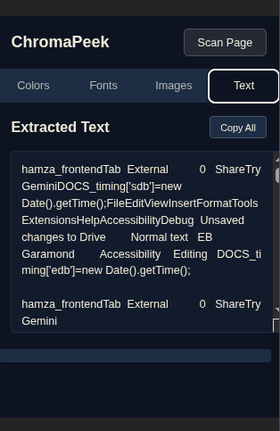

# ChromaPeek

A Chrome extension for inspecting and analyzing colors on web pages.

## Features

- 🎨 Pick colors from any webpage
- 📋 Copy color values in multiple formats (HEX, RGB, HSL)
- 💾 Color history and favorites
- 🎯 Easy-to-use interface

## Installation

1. Clone or download this repository
2. Open Chrome and go to `chrome://extensions/`
3. Enable "Developer mode" (top right)
4. Click "Load unpacked"
5. Select the `chromapeek` folder

## Development

This project uses:
- **React** + **Vite** for fast development
- **TypeScript** for type safety
- **ESLint** for code quality

### Quick Start

```bash
npm install
npm run dev
npm run build
```

## Project Structure

```
chromapeek/
├── src/
├── public/
├── manifest.json
└── package.json
```
# ChromaPeek

## Screenshots

### Color Extraction


### Font Detection


### Image Extraction


### Text Extraction

## Contributing

Contributions are welcome! Feel free to submit issues or pull requests.

## License

MIT License - feel free to use this project however you'd like.