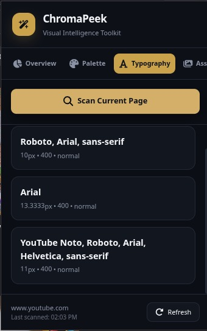
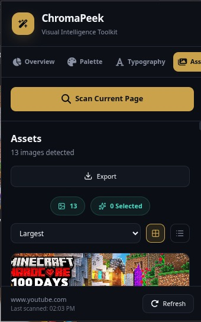
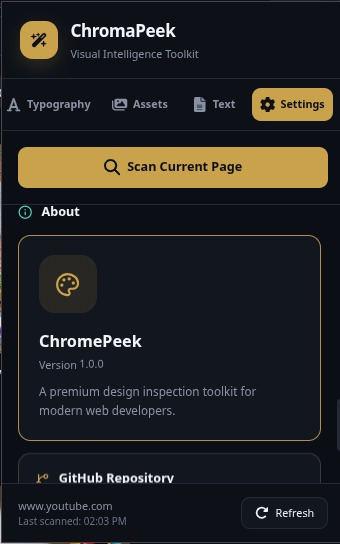
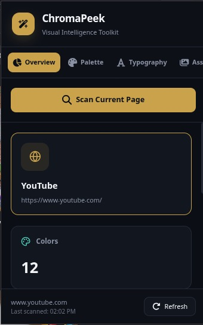

# ChromaPeek

A Chrome extension for inspecting and analyzing colors, fonts, and images on any webpage.

Scan the active tab to pull its color palette, typography, and image assets into a single popup — with live element inspection and JSON export for each.

## Features

- 🎨 **Color Palette** — extract every color used on the page as HEX/RGB swatches, with a one-click copy for individual colors or the full palette
- 🔎 **Live Inspect** — hover or click any element on the page to see its live typography (font family, size, weight, line height, letter spacing, color)
- 🅰️ **Typography** — see every font family used across the page at a glance, alongside the selected element's font details
- 🖼️ **Assets** — browse every image on the page in a sortable grid or list, select multiple, and download or copy their URLs
- 📄 **Text Extraction** — pull all readable text content from the page into a single copyable block
- 📤 **JSON Export** — colors, fonts, and images each export to a standalone JSON file from their respective tab

## Installation

This is an unpacked Chrome extension — it needs to be built before loading, since the popup is a Vite/React app.

1. Clone or download this repository
2. Install dependencies and build the extension:
   ```bash
   npm install
   npm run build:extension
   ```
3. Open Chrome and go to `chrome://extensions/`
4. Enable **Developer mode** (top right)
5. Click **Load unpacked**
6. Select the `dist` folder created by the build

## Development

This project uses:

- **React** + **Vite** for the popup UI
- **lucide-react** for icons
- **ESLint** for code quality
- Plain Chrome Extension APIs (Manifest V3) for the content script and background service worker — no framework on that side

### Quick Start

```bash
npm install
npm run dev              # local dev server for the popup UI
npm run build             # production build of the popup only
npm run build:extension   # production build + copies manifest.json, background.js, content.js, content.css into dist/
```

Use `npm run build:extension` when you actually want to load the extension in Chrome — `npm run build` alone only builds the popup and won't include the manifest or content scripts.

## Project Structure

```
chromapeek/
├── src/
│   ├── popup/          # Popup.jsx — main extension popup UI
│   └── components/      # ColorPalette, FontInspector, ImageExtractor, Overview, Settings, TextExtractor
├── public/
│   ├── manifest.json    # Manifest V3 config
│   ├── background.js    # Extension service worker
│   ├── content.js        # Injected into every page for scanning/inspection
│   └── content.css
└── package.json
```

## Permissions

ChromaPeek requests `activeTab`, `scripting`, `storage`, and `tabs`, plus host access to all URLs. These are used to inject the content script into the page you're scanning and to read its computed styles, colors, fonts, and images — nothing is sent off your machine.

## Screenshots

### Overview



### Typography



### Assets



### Settings



## Contributing

Contributions are welcome! Feel free to submit issues or pull requests.

## License

MIT License — feel free to use this project however you'd like.